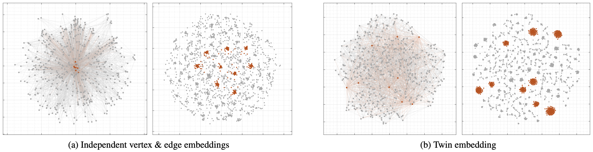
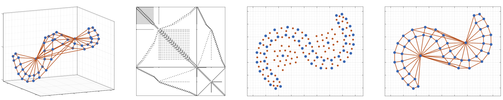

```@meta
CurrentModule = TuXartis
```

# TuXartis

## Vertex indices 
 * degree
 * local cluster coefficient
 * degree centrality
 * neighbor degree centrality
 * neighbor embeddedness centrality 
 * hits
 * (Perron) eigenvectoror centrality 

## Edge indices 
 * degree 
 * common neighbors (number of incident triangles)
 * Adamic-Adar
 * Ricci curvature 
   - sublist
   - another item
  
Inline math $\alpha x^2 + \beta x + \gamma$

Math equation
$$A x = b$$
on its own.



Independent 2D vertex embedding and edge embedding in case (a) vs. the 2D twin-embeddings in case (b) of a Barabási-Albert graph (n = 500 nodes, m = 2,485 edges).For each case, in the vertex embedding (to the left), the same 9 vertex points with the highest degrees and the line segments representing their respective incident edges are highlighted in red color. The highlighted line segments are translated to the corresponding edge points in the corresponding edge embedding space.



A pictorial introduction of the twin-embedding method and its key advantages with a stick sculpture comprised of 105 sticks and 50 joins. From left to right: (a) A non-planar graph for the sculpture with n = 50 nodes and m = 105 edges; (b) The (m + n) × (m + n) twin-embedding adjacency matrix; (c) A 2D twin-embedding of the graph. (c-1) The vertex points marked in blue and the edge points in red are interspersed. A blue vertex point has its adjacent vertex points in blue close by and also has its incident edges in red nearby. (c-2) The blue vertex points and the red edge points are well matched, manifesting the effect of self-assignment by the twin embedding. (c-3) The red point clusters indicate densely bundled edges at high-degree vertices. (d) The vertex embedding split from the twin embedding. Without external regulation, the line segments for the edges are well laid out and less prone to co-linear or overly crossing placements, as an evidence of the autonomous self-regulation induced by the twin-embedding method.

 
The subnetwork of vasculature cells from the [Tabula Sapiens biological network data](https://www.science.org/doi/10.1126/science.abl4896) in a 2D vertex vector/point embedding space (the left plot) and a 2D edge vector/point embedding space (the middle plot), obtained by the twin-embedding method introduced in this paper. The right plot displays the twin-embedding matrix of (1). The subnetwork G has n = 16,037 nodes for the cells and m = 158,885 edges.The line graph Gl has 6,384,850 edges. In the vertex embedding, the cell/vertex points are color-coded by the cell types, there are 14 cell types or classes. In the edge embedding, any point for an intra-class edge is colored by the same cell class color; any point for an inter-class edge is colored in black. As the edge points are nearly 10 times denser, the edge-point marker size is made a quarter of the vertex-point marker size. The vertex point cloud and the edge point cloud are superbly aligned in their global configurations as well in their class substructures.


A kNN graph (k=16) for the image data [`MNIST-DIGITS`](http://yann.lecun.com/exdb/mnist/) in a 2D vertex embedding space. The dataset contains 70,000 images of handwritten digits. Every point in the embedding space represents a digit image, colored by its digit class cluster. Each cluster is textured by sampled digit images, which are visible upon zoom-in. The clusters are spatially well separated. This advanced function is provided by `tuXartis`.
